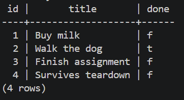

# Task API
 
A CRUD (Create, Read, Update, Delete) to-do list API built with Node.js and Express, backed by a PostgreSQL database running in Docker, with Redis wired in for future caching. Built across the FlyRank Internship's Backend Track — starting as an in-memory API, then SQLite, and now a fully containerized Postgres + Redis stack.
 
## How to run it
 
**Requirements:** Docker Desktop installed and running. Nothing else needs to be installed locally.
 
```bash
git clone https://github.com/Srinivas25046/todo-api.git
cd todo-api
cp .env.example .env
docker compose up
```
 
The API starts on `http://localhost:3000`. Interactive API docs (Swagger UI) are available at `http://localhost:3000/docs`.
 
To stop everything:
```bash
docker compose down
```
 
Your data survives this — it's kept in a Docker volume. To wipe it and start completely fresh:
```bash
docker compose down -v
docker compose up
```
 
If you change any code, rebuild the image before starting again:
```bash
docker compose up --build
```
 
## Environment variables
 
See `.env.example` for the required variables:
 
```
DATABASE_URL=postgres://postgres:dev@db:5432/tasks
REDIS_URL=redis://redis:6379
```
 
Copy it to `.env` before running (the command above does this for you).
 
## Endpoints
 
| Method | Path | Description | Success | Errors |
|---|---|---|---|---|
| GET | `/` | API info | 200 | — |
| GET | `/health` | Health check (verifies database connectivity) | 200 | 503 |
| GET | `/tasks` | List all tasks | 200 | — |
| GET | `/tasks/:id` | Get a single task | 200 | 404 |
| POST | `/tasks` | Create a task | 201 | 400 |
| PUT | `/tasks/:id` | Update a task | 200 | 400, 404 |
| DELETE | `/tasks/:id` | Delete a task | 204 | 404 |
 
Each task has: `id` (integer, auto-generated), `title` (string), `done` (boolean).
 
## Example request
 
```bash
curl -i -X POST http://localhost:3000/tasks \
  -H "Content-Type: application/json" \
  -d '{"title":"Buy milk"}'
```
 
```
HTTP/1.1 201 Created
Content-Type: application/json; charset=utf-8
 
{"id":4,"title":"Buy milk","done":false}
```
 
## Database
 
This project stores tasks in **PostgreSQL**, running as a Docker container.
 
**Why Docker + Postgres:** running Postgres in a container means anyone cloning this repo gets an identical, working database with zero manual installation, and the exact same database engine runs in development as would run in production. A named Docker volume (`taskdata`) keeps the actual data safe across container restarts and rebuilds.
 
The `tasks` table and its 3 seed rows are created automatically the first time the stack starts — no manual setup required.
 
**Database screenshot (from `psql` inside the container):**
 

 
## Redis
 
Added a `redis` service to `compose.yaml` (official `redis:7-alpine` image), connected to it on startup with the official `redis` npm client, and confirmed connectivity with a `PING` → `PONG` response.
 
## Architecture note: three storage engines, one API
 
This project's endpoints have not changed in shape or behavior across three completely different storage layers:
 
| Stage | Storage | Notes |
|---|---|---|
| Week 2 | In-memory JS array | Data lost on every restart |
| Week 3 | SQLite (`node:sqlite`) | Data in a single file, survives app restarts |
| Week 1/3 (this) | PostgreSQL in Docker | Data in a real database server, survives container rebuilds via a volume |
 
The same five endpoints, status codes, and validation rules work identically against all three. This is intentional — it demonstrates that storage is an implementation detail hidden behind a stable API, not something clients need to know or care about.
 
**A note on SQLite:** the assignment's suggested library, `better-sqlite3`, crashed with a native-binary compatibility error on this machine (Windows, Node 22). Rather than fight the native build toolchain, the project switched to Node's own built-in `node:sqlite` module, which needs no compiled binary at all and sidesteps that entire class of problem.